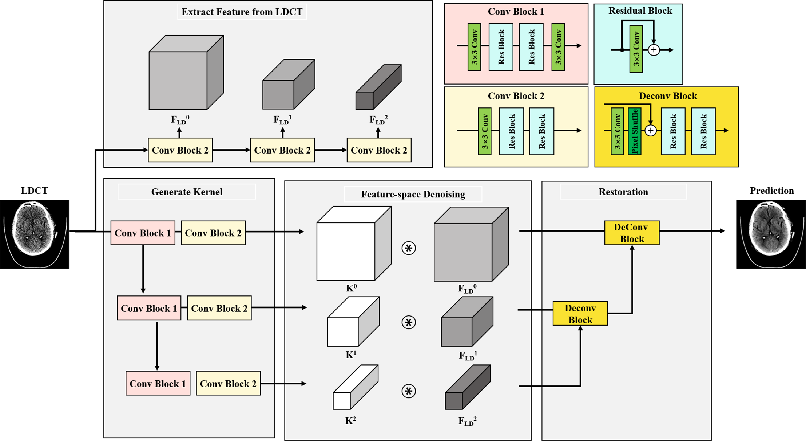
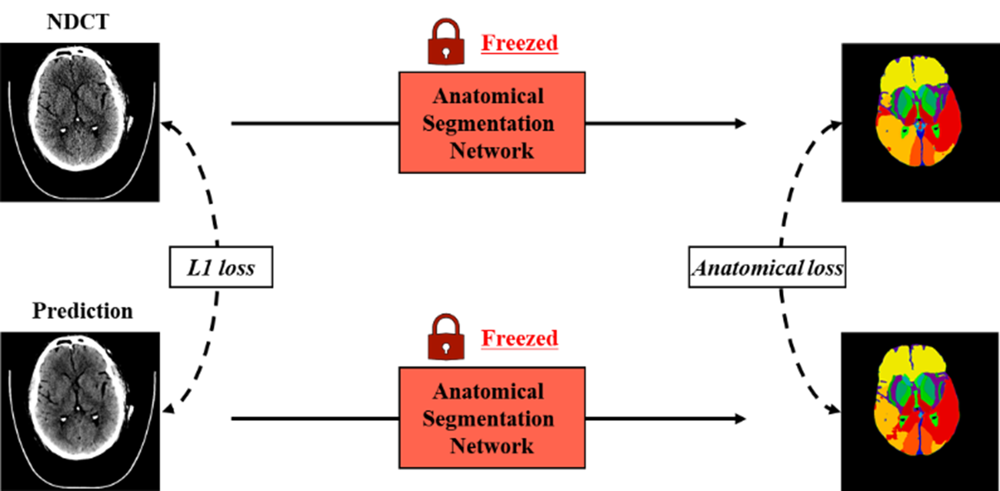
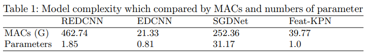
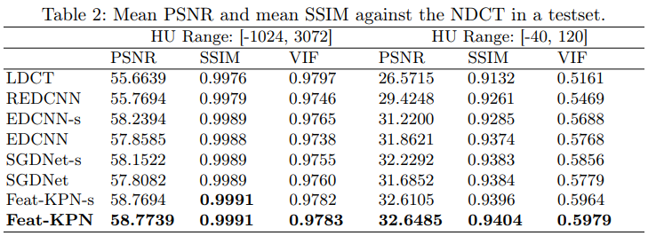
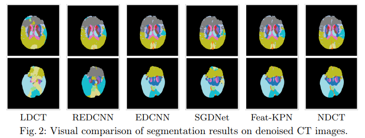

# FeatKPN-LDCT-enhancement

---

This repository provides the implementation of: 
Feature-space Kernel Prediction Network with Anatomical Perception for Denoising of Low-dose Brain CT

### Architecture

<div align="center">
    
</div>

**Feat-KPN** extracts multi-scale features from LDCT, 
predicts spatially adaptive kernels $K^{0,1,2}$, applies them to local features, 
and reconstructs the denoised CT image via progressive deconvolution.
Since CT noise typically shows a non-uniform, radially distributed pattern, 
spatially adaptive denoising provides a clear advantage over conventional CNNs with fixed kernels.

### Anatomical Perception Loss

<div align="center">
    
</div>

We integrates the following components 1) L1 loss to alleviate over-smoothing effects, 2) latent-space alignment with a pre-trained
brain NDCT model to enhance perceptual fidelity, and 3) segmentation-guided learning to preserve anatomical structure.

## Installation

---
```bash
git clone https://github.com/jiwoosong/FeatKPN-LDCT-enhancement.git
cd FeatKPN-LDCT-enhancement
pip install -r requirements.txt
```
* Dependency
  * Python >= 3.9

## Preparation

---
### Dataset Preparation
We follow the protocol described in the paper using the Low-Dose CT and Projection Dataset:
1. Download the dataset from [AAPM Low Dose CT Grand Challenge 2016](https://www.aapm.org/GrandChallenge/LowDoseCT/).
2. Convert Dicom series into NIFTI format.
   ```bash
   ./Data/
    ├── 2_NIFTI_Data
        ├── N005
            ├── full.nii.gz
            └── low.nii.gz
        ├── ...
        └── N300
   ```
3. Adjust `--data_path` and `--subject_path` arguments if using a different directory.

### Anatomical Segmentation Model Preparation
The anatomical loss uses a pre-trained model: [Fully Automated Segmentation of Head CT Neuroanatomy Using Deep Learning](https://doi.org/10.1148/ryai.2020190183).
And the author release this project in [github page](https://github.com/jasonccai/HeadCTSegmentation) with Tensorflow.

So we re-implement this project into pytorch. Download the [converted model weight](https://1drv.ms/u/c/7ecb33c3ddef116b/ETvrNGKp4utIhgp--vaTf0EBqNVP2QVE7AYwAbv0QP8ecg?e=iZYhgz) and place it in `Model/Anatomical_Segmentation/`.

## Training

---
The proposed model can be trained with
```
Python trainer.py --data_path ../Data --subject_path ../Data/train_val_split.pickle --model_name KPNFeat --nf 16  --nk16 --loss_type l1_l1ana_1 --ana_weight 0.01
```

## Results

---
* Parameter Comparison
    <div align="center">
        
    </div>
* Quantitative Results
    <div align="center">
        
    </div>
* Qualitative Results
    <div align="center">
        
    </div>

## Citation


